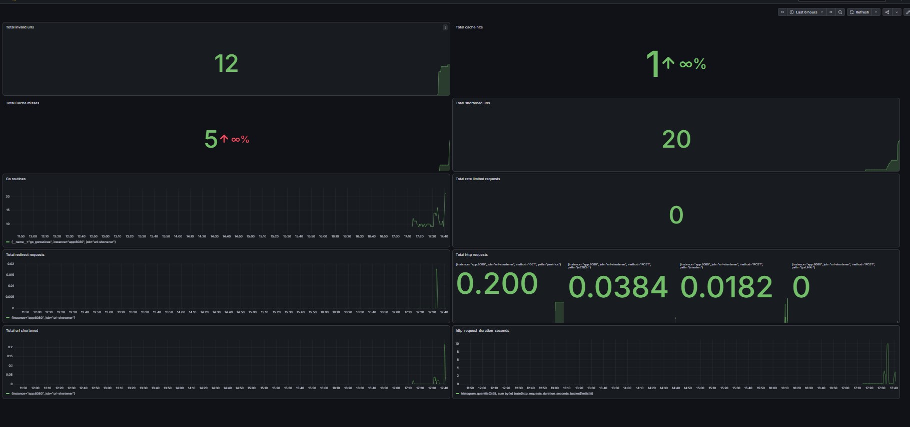
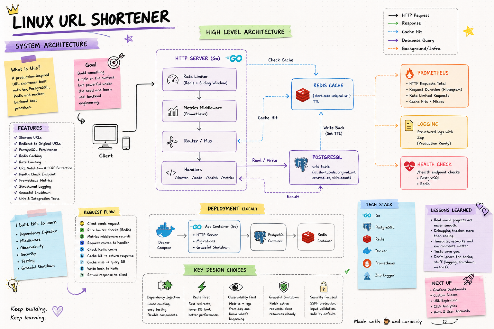
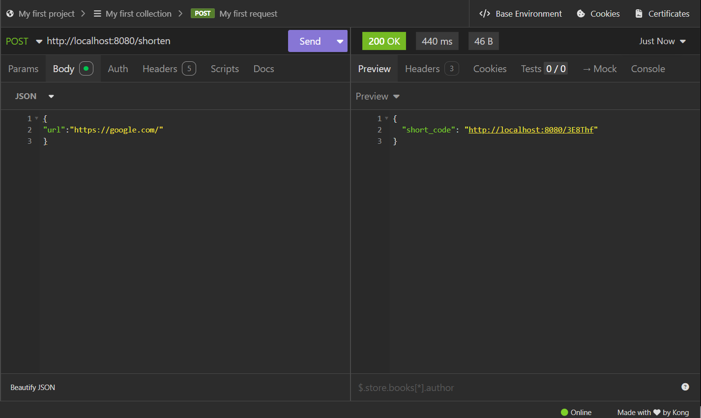
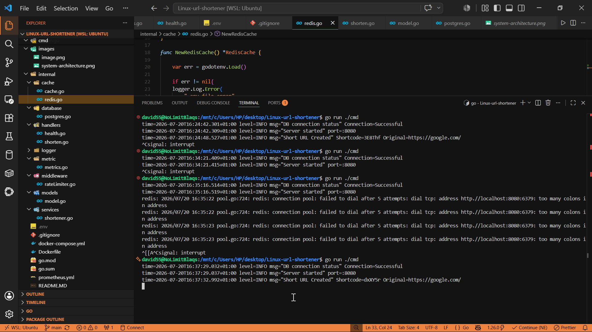

# Linux URL Shortener

A production-inspired URL shortener built with Go.

This project started as a simple **"shorten a URL"** application.

Very quickly, the goal changed.

Instead of building another CRUD project, I wanted to understand how backend services are actually built, monitored, tested and operated in production.

Along the way I learned about databases, caching, observability, testing, graceful shutdown, dependency injection, Docker, security and a lot of debugging.

---

# Tech Stack

- Go
- PostgreSQL
- Redis
- Docker
- Prometheus
- Grafana

### Planned

- GitHub Actions
- Kubernetes

---

## Grafana dashboard



# System Architecture



---

# Demo





---

# Features

### Core

- Generate short URLs
- Redirect shortened URLs
- PostgreSQL persistence
- Redis caching
- Indexed database lookups

### Security

- URL validation
- SSRF protection
- DNS abstraction
- HTTP client abstraction
- Rate limiting

### Observability

- Prometheus metrics
- Request counters
- Request latency histogram
- Structured logging
- Health check endpoint

### Reliability

- Graceful shutdown
- Environment variable configuration
- Unit tests
- Integration tests

---

# System Trade-offs

Every design has compromises.

Current trade-offs include:

- Single Go HTTP server (single point of failure)
- No database replication
- No load balancing
- Redis memory can become full
- Fixed-window rate limiting can be bypassed near window boundaries

---

# Edge Cases Handled

Some of the scenarios the application handles include:

- Cache hits
- Cache misses
- Duplicate short-code detection
- Invalid URLs
- Private IP addresses
- Loopback addresses
- Unsupported URL schemes
- SSRF attacks
- Dependency health checks

---

# What I Learned

This project taught me much more than URL shortening.

Some of the biggest topics I learned include:

- Dependency Injection
- Interfaces in Go
- Repository pattern
- Redis caching
- SQL indexing
- Docker
- Environment variables
- Prometheus
- Histograms vs Counters
- HTTP middleware
- Contexts
- Graceful shutdown
- Unit testing
- Integration testing
- DNS resolution
- SSRF protection
- Production logging

---

# Biggest Challenges

This project definitely wasn't built in one sitting.

## Docker

Docker was completely new to me.

Even building my first container felt confusing.

I spent a lot of time understanding images, containers and Dockerfiles before everything finally worked.

---

## Rate Limiting

My first implementation rate-limited every request.

The bug wasn't Redis.

It was my middleware logic.

Debugging it taught me how middleware execution order works in Go.

---

## Prometheus

At one point my `/metrics` page was completely blank.

I thought Prometheus was broken.

It wasn't.

I had forgotten to wrap my router with the metrics middleware.

That bug helped me understand how middleware chaining actually works.

---

## DNS Lookup Tests

This was easily one of the hardest parts of the project.

I refactored my validator to use dependency injection so DNS lookups could be mocked during testing.

Getting those tests working took much longer than expected.

Eventually I discovered the validator wasn't the problem.

My internet connection was.

The requests kept timing out.

Increasing the timeout fixed everything.

That experience reminded me that sometimes the environment—not the code—is the real bug.

---

## URL Validation

I also learned that validating URLs is much harder than I expected.

It's not enough to check whether a string "looks like" a URL.

I had to account for:

- localhost
- loopback addresses
- private networks
- malformed URLs
- unsupported protocols
- SSRF attacks

---

## Graceful Shutdown

Before this project I had never thought about how servers stop.

Now I understand why production services wait for active requests to finish before exiting.

I also learned how operating systems notify applications using signals like **SIGINT** and **SIGTERM**.

---

# What I'm Most Proud Of

I'm proud that I didn't stop once the application worked.

Instead, I kept adding features that users rarely notice but backend engineers care about.

Those include:

- Redis caching
- Metrics
- Health checks
- Structured logging
- Testing
- Graceful shutdown
- Security improvements

Those features taught me far more than building another CRUD application ever could.

---

# Current Limitations

The project still has room for improvement.

Current limitations include:

- Docker Compose setup needs polishing
- Grafana dashboard isn't configured
- Custom aliases aren't supported
- URL expiration isn't implemented
- Click analytics aren't available
- No authentication
- No admin dashboard
- Distributed rate limiting isn't implemented

---

# Future Improvements

- Custom aliases
- URL expiration
- Click analytics
- User accounts
- JWT authentication
- API documentation
- CI/CD pipeline
- Kubernetes deployment
- Distributed deployment

---

# Running the Project

Clone the repository.

```bash
git clone https://github.com/YOUR_USERNAME/Linux-url-shortener.git
cd Linux-url-shortener
```

Install dependencies.

```bash
go mod download
```

Create your environment variables.

```bash
cp .env.example .env
```

Run locally.

```bash
go run ./cmd
```

Or run with Docker.

```bash
docker compose up --build
```

---

# API

## Create Short URL

```http
POST /shorten
```

Example request:

```json
{
  "url": "https://google.com"
}
```

---

## Redirect

```http
GET /{shortcode}
```

---

## Health Check

```http
GET /health
```

---

## Prometheus Metrics

```http
GET /metrics
```

---

# If I Built It Again

If I were starting over, I would:

- Design interfaces earlier
- Write tests sooner
- Separate packages earlier
- Centralize configuration from day one
- Spend more time designing middleware before writing code
- Think about observability much earlier

---

# Final Thoughts

This project became much bigger than I expected.

I started by trying to build a URL shortener.

I ended up learning how backend services are designed, tested, monitored and operated in production.

There's still plenty to improve, but this project represents a huge milestone in my backend engineering journey.

I'm continuing to improve it as I learn more about cloud engineering, distributed systems and system design.