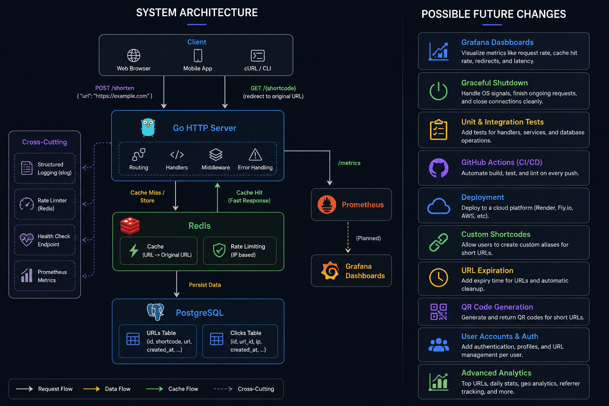

# Linux URL Shortener

A production-inspired URL shortener built in Go while learning backend engineering, Linux, Docker, Redis, PostgreSQL, and system design.

This project started as "I'll just build a URL shortener."

It quickly turned into one of the hardest projects I've built.

Instead of following a tutorial from start to finish, I built every feature myself, researched documentation, fixed bugs, broke the application multiple times, rebuilt parts of it, and gradually turned it into something that resembles a real backend service.

## The System Architecture 


# Features

- Create short URLs
- Redirect shortened URLs
- PostgreSQL persistence
- Redis caching
- Redis rate limiting
- Database indexing
- Click analytics
- Structured logging using Go's slog package
- Docker support
- Environment variable configuration
- Health check endpoint
- Prometheus metrics

---

# Tech Stack

- Go
- PostgreSQL
- Redis
- Docker
- Prometheus
- Linux (WSL2)
- Git
- GitHub

---

# What I Learned

This project taught me much more than writing CRUD APIs.

I learned:

- Building REST APIs in Go
- Organizing large Go projects
- PostgreSQL
- Redis
- Docker
- Docker networking
- Environment variables
- Database indexing
- Rate limiting
- Structured logging
- Prometheus metrics
- Health checks
- Concurrency using goroutines
- Linux development using WSL2
- Reading documentation instead of relying on tutorials

More importantly, I learned that backend engineering is much more than writing endpoints.

Most of the work happens around reliability, monitoring, debugging, performance and infrastructure.

---

# Challenges

This project was easily one of the most frustrating projects I've built.

Some of the issues I had to solve included:

- Learning Linux while building the project
- Configuring WSL2
- PostgreSQL connection errors
- Docker networking issues
- Redis integration
- Environment variable bugs
- Database migration mistakes
- Debugging Go errors without much experience
- Getting Docker containers to communicate properly
- Learning Prometheus from scratch

There were multiple times where I wanted to move on to another project.

Instead, I kept fixing one problem at a time.

Looking back, solving those problems taught me more than writing the actual features.

---

# Running the Project

Clone the repository

```bash
git clone https://github.com/YOUR_USERNAME/Linux-url-shortener.git
cd Linux-url-shortener
```

Install dependencies

```bash
go mod download
```

Create your environment variables

```bash
cp .env.example .env
```

Run

```bash
go run ./cmd/server
```

or

```bash
docker compose up --build
```

---

# API

## Create Short URL

```
POST /shorten
```

Example request

```json
{
    "url":"https://google.com"
}
```

---

## Redirect

```
GET /{shortcode}
```

---

## Health Check

```
GET /health
```

---

## Prometheus Metrics

```
GET /metrics
```

---

# Current Limitations

The project is still a work in progress.

Things I'm currently improving:

- Docker Compose setup still needs refinement.
- Prometheus works, but Grafana dashboards haven't been configured yet.
- No automated tests yet.
- No CI/CD pipeline.
- No production deployment yet.
- No authentication or user accounts.
- No URL expiration or custom aliases.

---

# Future Improvements

- Grafana dashboards
- Graceful shutdown
- GitHub Actions
- Unit testing
- Production deployment
- Custom shortcodes
- URL expiration
- QR code generation
- CI/CD with GitHub Actions
- Kubernetes deployment

---

# SEO Keywords

For anyone discovering this project:

Go URL Shortener, Golang URL Shortener, Backend Engineering, Go REST API, PostgreSQL, Redis Cache, Docker, Docker Compose, Prometheus, System Design, Linux Development, Distributed Systems, Backend Portfolio Project, Rate Limiting, URL Shortener API.

---

# Final Thoughts

This project isn't meant to be perfect.

It's a snapshot of my backend engineering journey.

The goal wasn't just to build a URL shortener—it was to understand the technologies and design decisions behind modern backend systems.

I'm continuing to improve it as I learn more about cloud engineering, distributed systems, and system design.