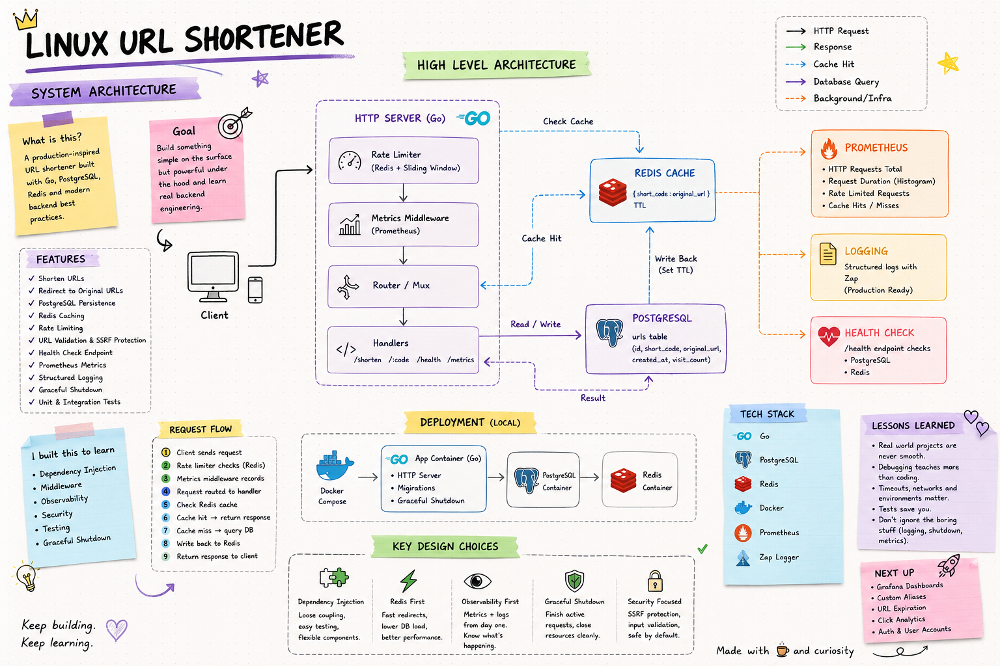
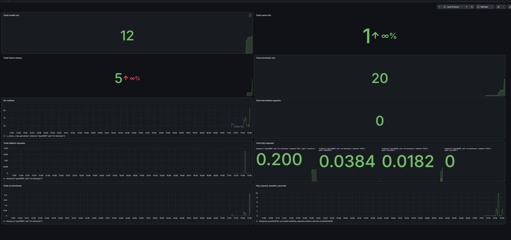
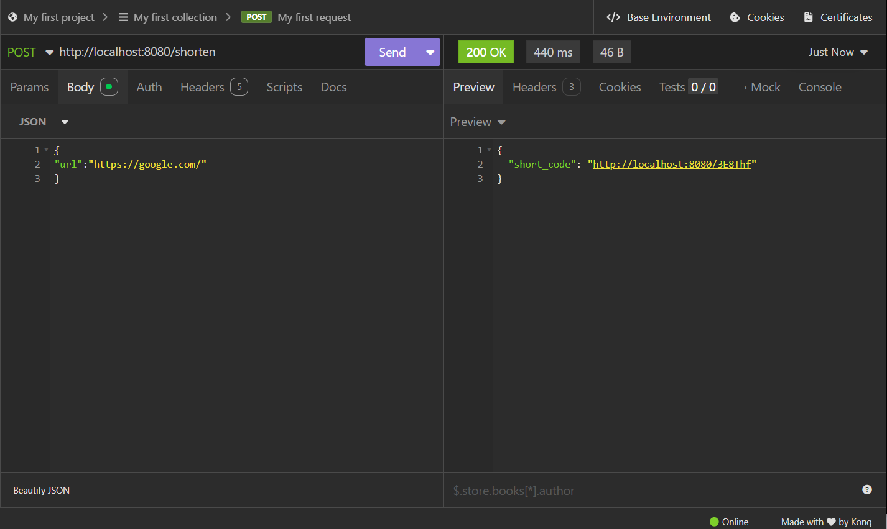
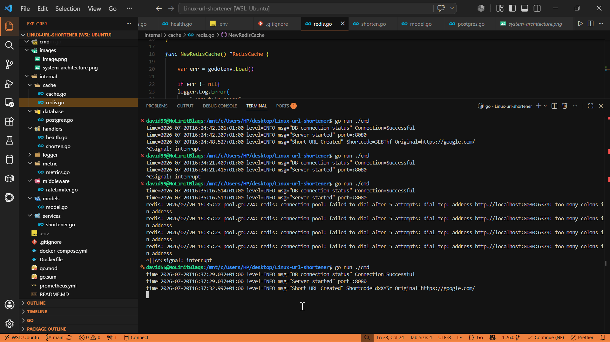

# Linux URL Shortener

A production-inspired URL shortener built in **Go** with a focus on reliability, observability, and backend engineering best practices.

Rather than building another CRUD project, I used this project to learn how production backend services are designed, tested, monitored, and deployed.

---

## Features

### Core
- Shorten long URLs
- Redirect shortened URLs
- PostgreSQL persistence
- Redis caching
- Indexed database lookups

### Security
- URL validation
- SSRF protection
- DNS resolution
- HTTP client abstraction
- Rate limiting

### Observability
- Prometheus metrics
- Grafana dashboards
- Structured logging
- Health check endpoint
- Request latency metrics

### Reliability
- Graceful shutdown
- Environment-based configuration
- Unit tests
- Integration tests
- Docker support

---

## Tech Stack

- Go
- PostgreSQL
- Redis
- Docker
- Prometheus
- Grafana
- GitHub Actions (v2)

---

## Architecture



---

## Monitoring

### Grafana Dashboard



---

## Demo





---

# Version History

## v1.0

Production-ready backend featuring:

- PostgreSQL
- Redis
- Prometheus
- Grafana
- Graceful Shutdown
- URL Validation
- SSRF Protection
- Structured Logging
- Docker
- Unit & Integration Tests

---

## v2 Branch (In Progress)

Development continues on the **v2** branch.

Current improvements include:

- GitHub Actions CI
- Automatic formatting (`gofmt`)
- Static analysis (`go vet`)
- Repository abstraction
- Handler unit tests
- Improved project architecture
- Increased test coverage

---

# Trade-offs

Current architectural trade-offs:

- Single Go server
- No database replication
- No load balancer
- Redis is memory-bound
- Fixed-window rate limiter

---

# Edge Cases Handled

- Cache hits & misses
- Duplicate short codes
- Invalid URLs
- Private IPs
- Loopback addresses
- Unsupported protocols
- SSRF attacks
- Dependency health checks

---

# Biggest Challenges

A few things that pushed me while building this project:

- Learning Docker from scratch
- Debugging middleware execution order
- Integrating Prometheus metrics
- Mocking DNS lookups for testing
- Building secure URL validation
- Understanding graceful shutdown

One memorable bug came from my DNS validation tests. After spending hours debugging, I discovered the validator wasn't broken—my internet connection was causing the requests to time out. Increasing the timeout fixed the issue and reminded me that sometimes the environment, not the code, is the problem.

---

# What I Learned

This project helped me gain hands-on experience with:

- Dependency Injection
- Interfaces
- Repository Pattern
- Redis Caching
- SQL Indexing
- Prometheus & Grafana
- Docker
- HTTP Middleware
- Contexts
- Graceful Shutdown
- Unit Testing
- Integration Testing
- Production Logging
- Backend Security

---

# Roadmap

Planned improvements:

- Custom aliases
- URL expiration
- Click analytics
- JWT authentication
- Admin dashboard
- Distributed rate limiting
- Kubernetes deployment

---

# Running

Clone the repository:

```bash
git clone https://github.com/YOUR_USERNAME/Linux-url-shortener.git
cd Linux-url-shortener
```

Install dependencies:

docker compose up --build
```

Configure environment variables:

```bash
cp .env.example .env
```

Run locally:

```bash
go mod download
go run ./cmd
```

Or with Docker:

```bash
docker compose up --build
```

---

## API examples

### Create Short URL

```bash
curl -s -X POST http://localhost/shorten \
  -H 'Content-Type: application/json' \
  -d '{"url":"https://example.com"}'
```

```json
{
  "url":"https://google.com"
}
```

### Redirect

```bash
curl -s http://localhost/health/ready
```

### Health

| Variable | Role |
|----------|------|
| `DB_PASSWORD` | Required — no silent empty secret |
| `BASE_URL` | Public URL embedded in short links (nginx / VPS IP / domain) |
| `RATE_LIMIT_*` | Token-bucket capacity, refill, TTL |
| `APP_ENV` | `production` → JSON logs |

Invalid or missing required config fails **at startup**, not on the first request.

### Metrics

```bash
# Unit (default)
go test ./... -race -count=1

# Integration (Docker required)
go test -tags=integration ./tests/integration/ -v -count=1 -timeout 15m
```

---

# Final Thoughts

This project started as a simple URL shortener but evolved into a platform for learning production backend engineering.

It introduced me to caching, observability, testing, graceful shutdown, security, and infrastructure—skills that go far beyond building CRUD applications.

I'm continuing to improve it as I learn more about distributed systems, cloud engineering, and system design.
